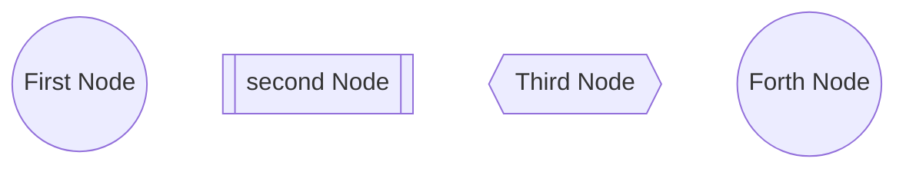

# Header1
## Header 2
### Header 3
#### Header 4
##### Header 5
###### Header 6
####### There is no Header 7

_Hello world!_




```bash 
ls A((First Node))
sudo apt install terminator B[[second Node]]
C{{Third Node}}
for i in ls:

case
esac
D((Forth Node))
```


[[Test node]]


http://obsidian.md - automatic!
[Obsidian](http://obsidian.md)
[Link to note](obsidian://open?path=D:%2Fpath%2Fto%2Ffile.md)
[Link to note](obsidian://open?vault=MainVault&file=MyNote.md)
[Export options](Pasted%20image)

[Slides Demo](<Slides Demo>)

```math


```

```math
a^2+b^2=c^2
```
[Reference](https://csrgxtu.github.io/2015/03/20/Writing-Mathematic-Fomulars-in-Markdown/)

$\alpha$
$A$
$\beta$

$\cos$ 	\cos
$\sin$ 	\sin
$\lim$ 	\lim
$\exp$ 	\exp
$\to$ 	\to
$\infty$ 	\infty
$\equiv$ 	\equiv
$\bmod$ 	\bmod
$\times$ 	\times

$k_{n+1}$ 	k_{n+1}
$k_n^2$ 	n^2
$k_n^2$ 	k_n^2
$(a)$ 	(a)
$[a]$ 	[a]
${a}$ 	{a}
$\langle f \rangle$ 	\langle f \rangle
$\lfloor f \rfloor$ 	\lfloor f \rfloor
$\lceil f \rceil$ 	\lceil f \rceil
$\ulcorner f \urcorner$ 	\ulcorner f \urcorner
$a’$ $a^{\prime}$ 	a` a^{\prime}`
$a’’$ 	a’’
$\hat{a}$ 	hat{a}
$\bar{a}$ 	\bar{a}
$\grave{a}$ 	\grave{a}
$\acute{a}$ 	\acute{a}
$\dot{a}$ 	\dot{a}
$\ddot{a}$ 	\ddot{a}
$\not{a}$ 	\not{a}
$\mathring{a}$ 	\mathring{a}
$\overrightarrow{AB}$ 	\overrightarrow{AB}
$\overleftarrow{AB}$ 	\overleftarrow{AB}
$a’’’$ 	a’’’
$\overline{aama}$ 	\overline{aaa}
$\check{a}$ 	\check{a}
$\vec{a}$ 	\vec{a}
$\underline{a}$ 	\underline{a}
$\color{green}x\dots$ 	\color{red}x
$\pm$ 	\pm
$\mp$ 	\mp
$\int y \mathrm{d}x$ 	\int y \mathrm{d}x
$,$ 	,
$:$ 	:
$;$ 	;
$!$ 	!
$\int y, \mathrm{d}x$ 	\int y, \mathrm{d}x
$\dots$ 	\dots
$\ldots$ 	\ldots
$\cdots$ 	\cdots
$\vdots$ 	\vdots
$\ddots$ 	\ddots

> Human beings face ever more complex and urgent problems, and their effectiveness in dealing with these problems is a matter that is critical to the stability and continued progress of society.
>\- Doug Engelbart, 1961

First Header | Second Header
:----: | :-----:
Content from cell 1 | Content from cell 2
Content in the first column | Content in the second column

      
```bash 
Dkywuzc\*7ss

      
root flag reel2
abc92606a01ca8cdb85efda1d4ca1f88
```